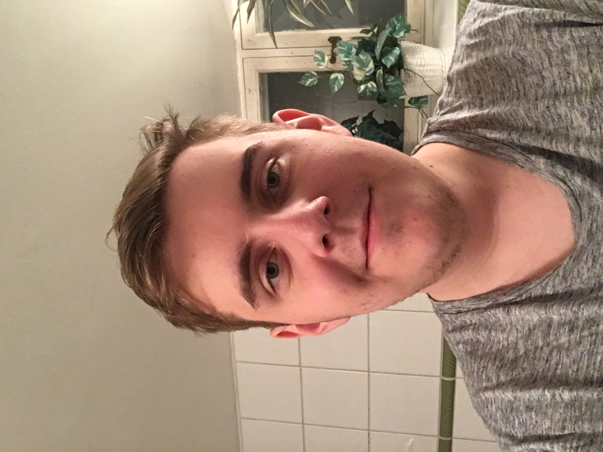

---
titleBreadcrumb: Home
...
Min me-sida - Hem
===============================

Hej! Jag heter Axel och pluggar Webbprogrammering på BTH i Karlskrona.

Född och uppvuxen i Katrineholm, en liten ort 90 minuter väst om Stockholm. Gillar att mecka med saker. Typ internet, datorer, hårdvara. Typisk geek. Började plugga på BTH för jag tyckte programmering verkade som ett riktigt häftigt yrke. Utöver att hålla på med teknik så älskar jag musik, framförallt AC/DC (har de gjort något dåligt egentligen?). Youtube & serier tar upp en hel del tid också. Gamla komediserier kan jag lägga timmar på utan att märka det :P

Vi hörs i forumen gott folk!

 
Axel pluggar Webbprogrammering på BTH i Karlskrona.

